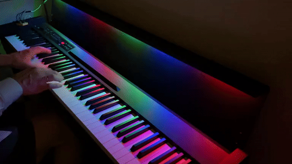
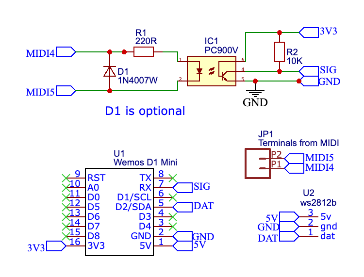
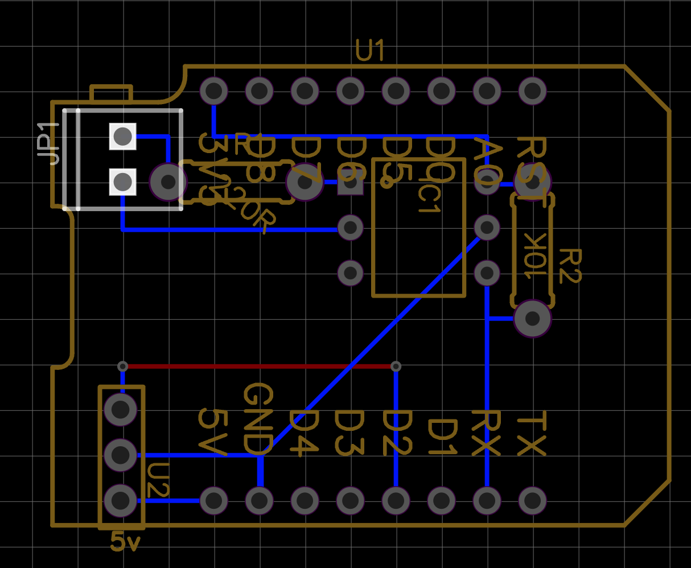
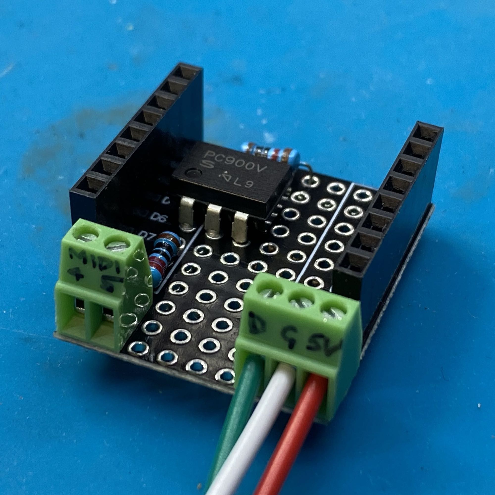
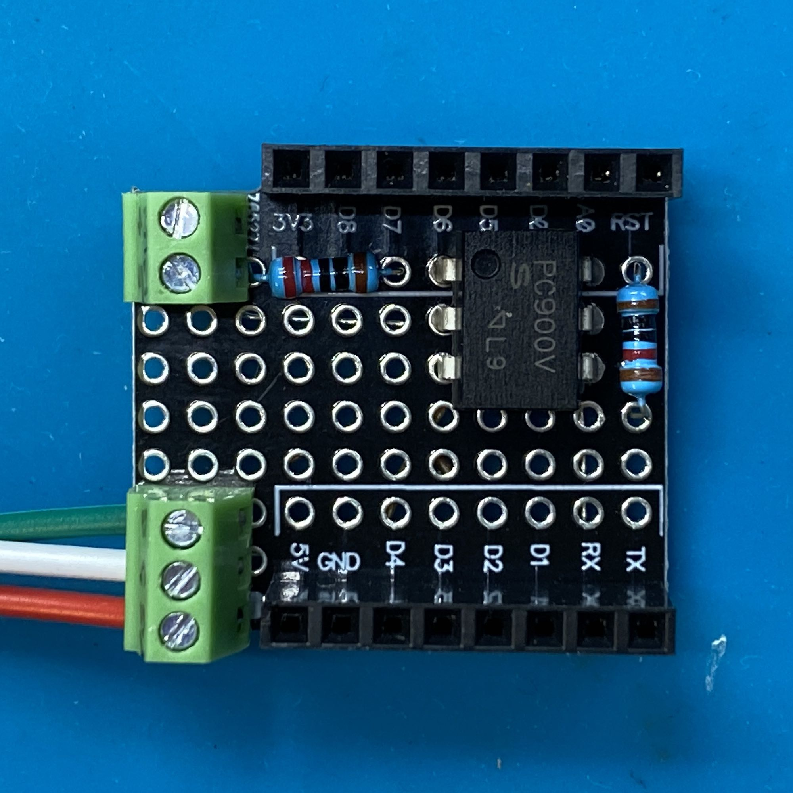
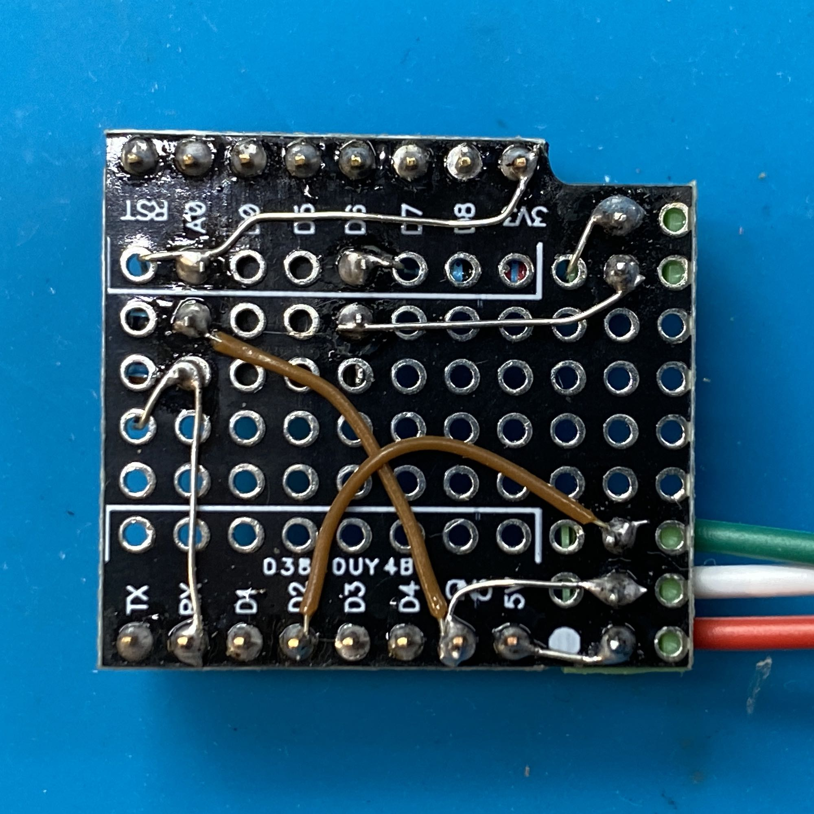
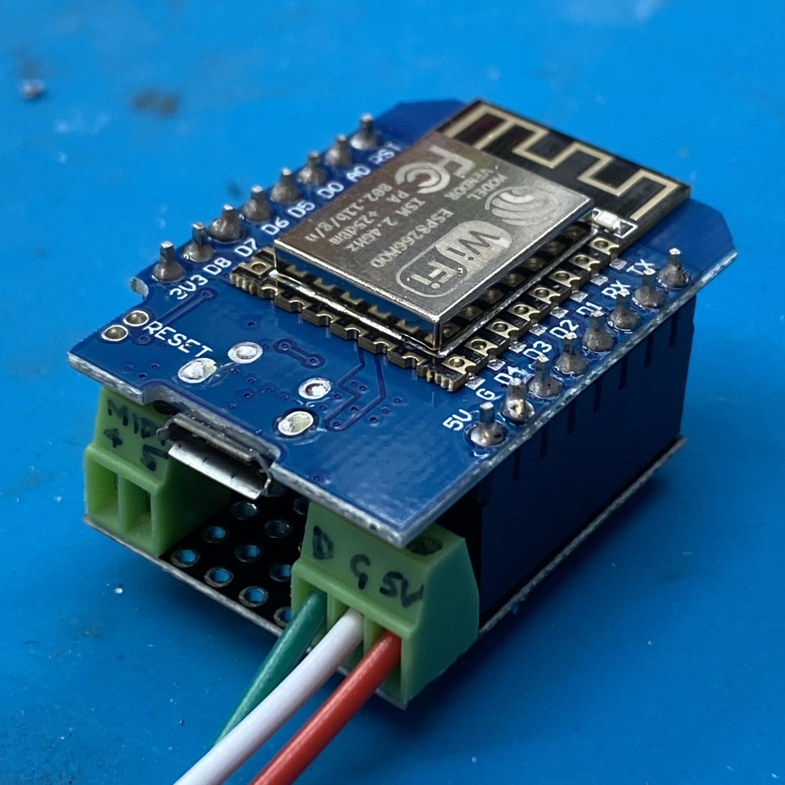
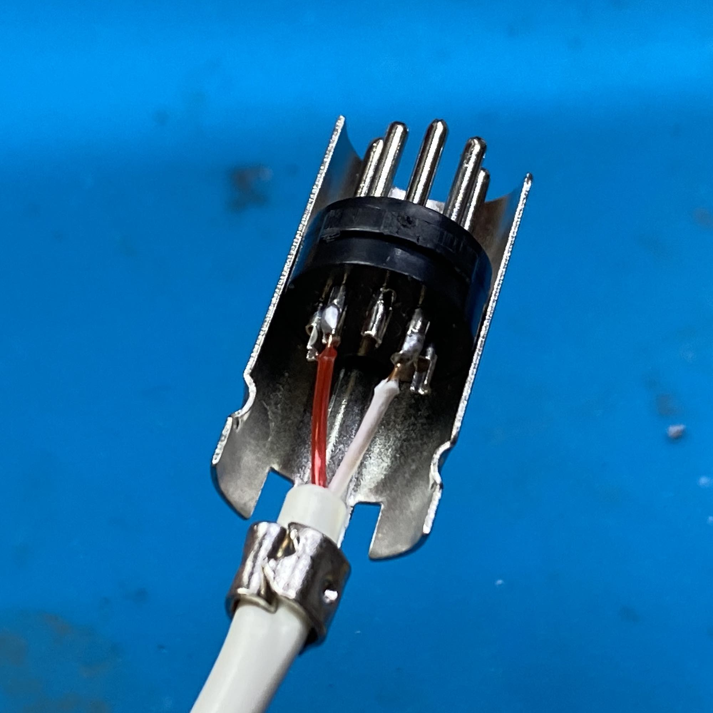

# ESPHome MIDI

MIDI In component for ESPHome


## Installing

```yaml
external_components:
  - source:
      type: git
      url: https://github.com/muxa/esphome-midi
```

## Hardware

I've added LED light effects to my MIDI keyboard.



This is what I've used:

- Wemos D1 Mini
- Prototype Base for Wemos D1 Mini
- PC900V optocoupler
- 220R and 10K resistors
- 1x2 and 1x3 2.54mm pitch screw terminals
- Male 5 pin DIN connector
- WS2812B 5V LED strip (powered via Wemos D1 Mini USB)

Note: schematic has a 1N4007W diode, but I have not used it.

| Image                                                             | Description                                 |
| ----------------------------------------------------------------- | ------------------------------------------- |
|  | Full schematic (Uses Wemos D1 Mini)         |
|                     | Layout of components on the prototype board |
|                 | Assembled prototype board                   |
|           | Assembled prototype board (top)             |
|        | Assembled prototype board (bottom)          |
|                          | Assembled device                            |
|                      | DIN connector wiring                        |

## Usage

See [full documentation](components/midi_in.md).

> Note that documentation is generated from RST format ready to use in `esphome-docs`.